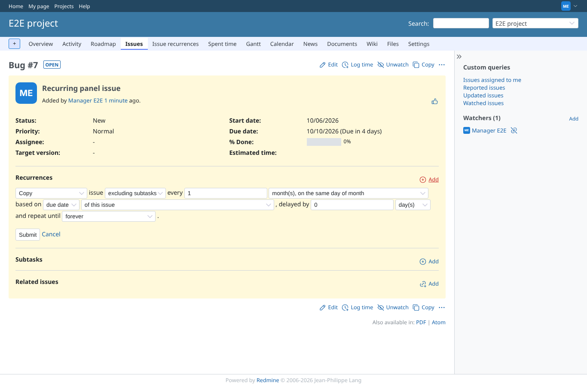
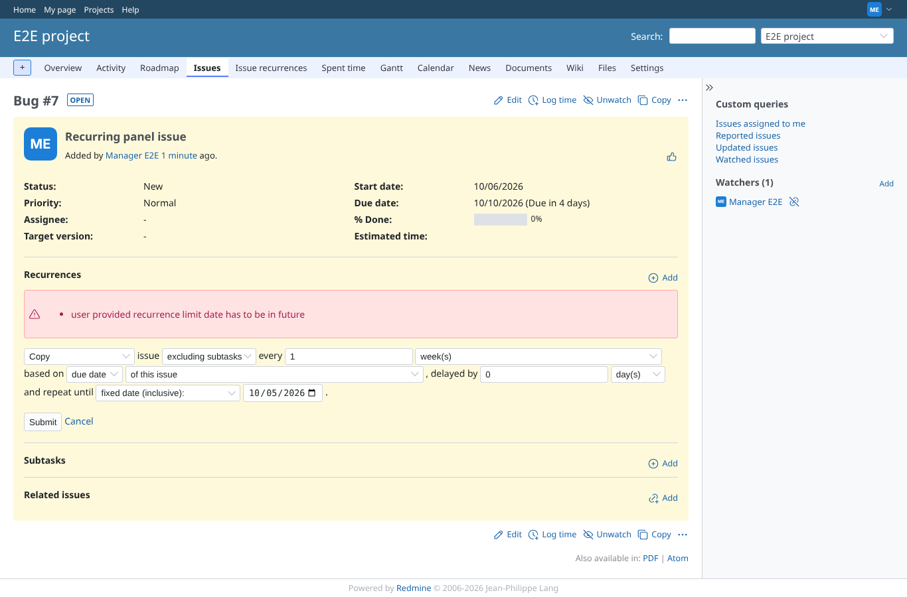
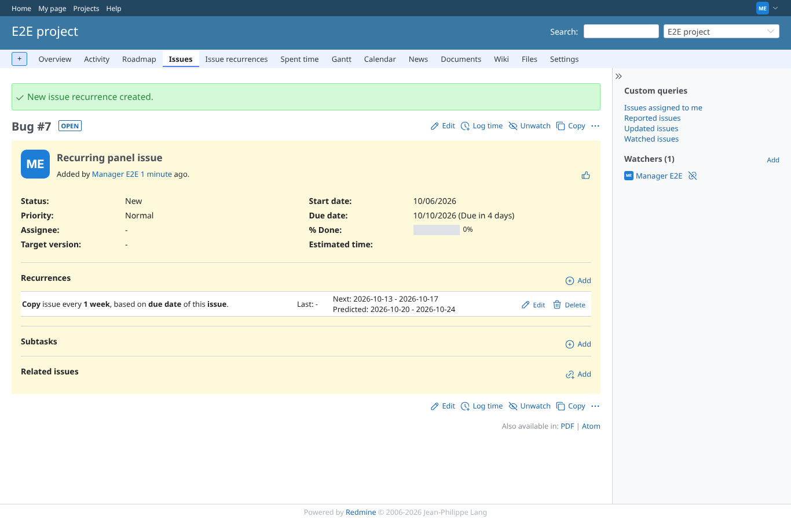
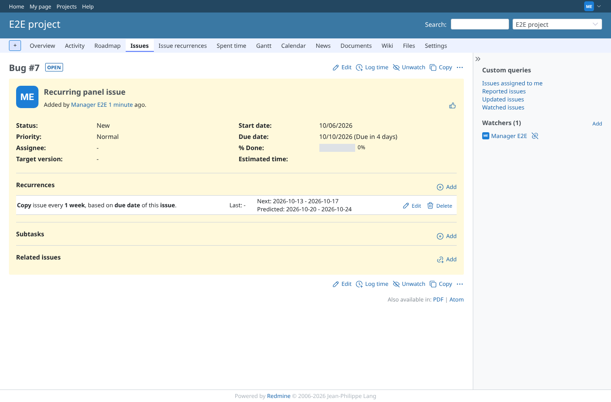
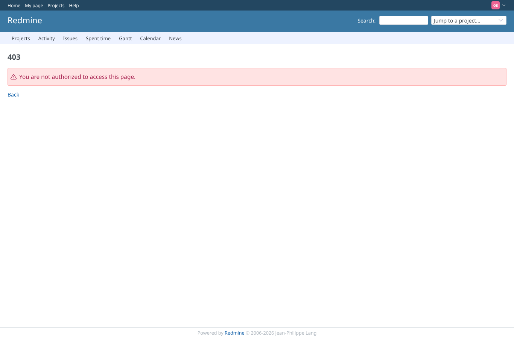

# add-recurrence

Run 2026-10-06T20:40:48.909Z against http://127.0.0.1:3000.

| screenshot | user | URL | shows |
|---|---|---|---|
|  | manager | `/issues/7` | Add opens the recurrence form inside the panel (AJAX) |
|  | manager | `/issues/7` | A date limit in the past is refused with a message, nothing is created, no success notice |
|  | manager | `/issues/7` | Created: notice, description "every 1 week", next/predicted dates, edit and delete icons |
|  | manager | `/issues/7` | After a reload the recurrence is still there (saved) |
|  | reporter | `/issues/7/recurrences/new` | Reporter: new form refused (403); POST create.js answered 403, new.js 403 |
|  | outsider | `/issues/12/recurrences/new` | Outsider: the form for an issue of the private project is refused (403) |
