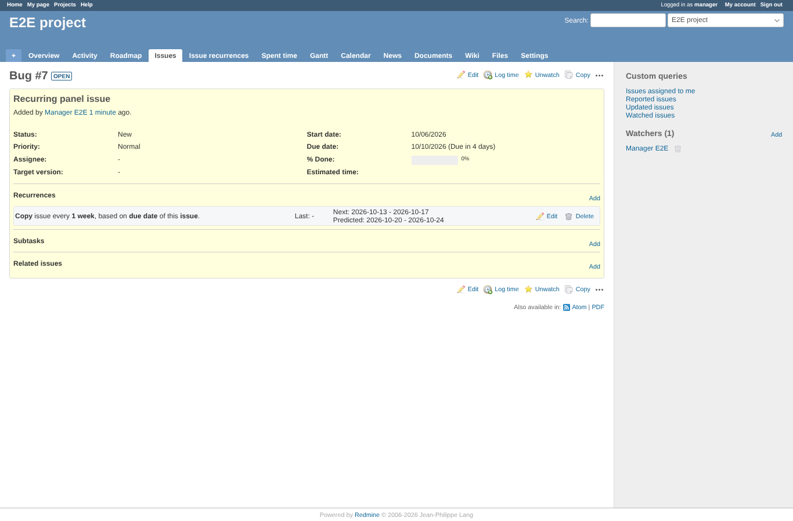
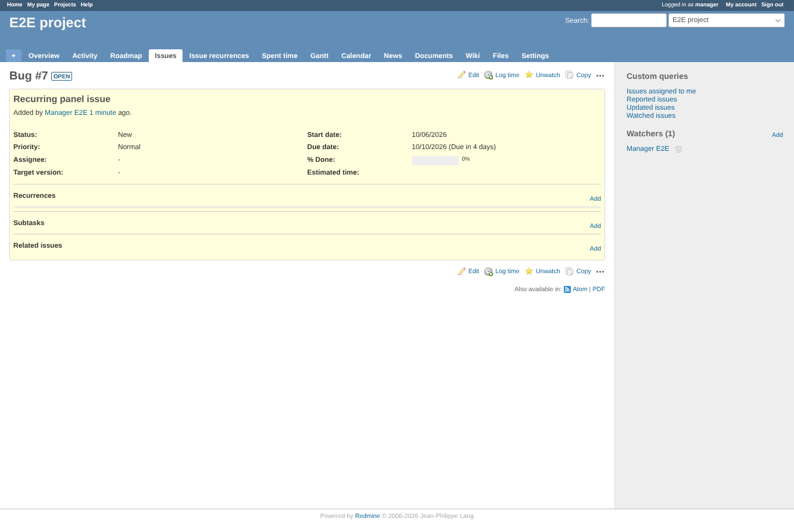

# delete-recurrence

Run 2026-10-06T20:49:30.025Z against http://127.0.0.1:3001.

| screenshot | user | URL | shows |
|---|---|---|---|
|  | manager | `/issues/7` | Manager: the recurrence before deleting (reporter DELETE answered 403, record kept) |
|  | manager | `/issues/7` | Deleted: row removed, notice "Issue recurrence deleted." |

## Problems

- no notice after delete
- wrong notice
