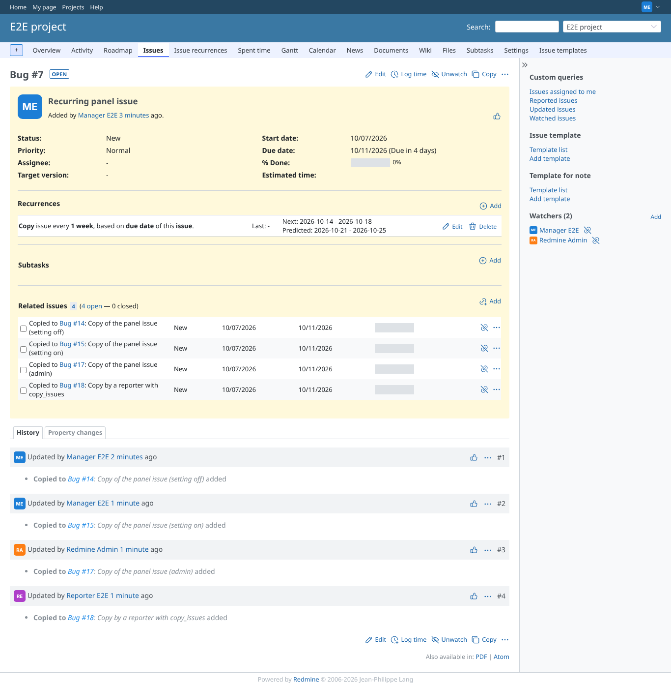
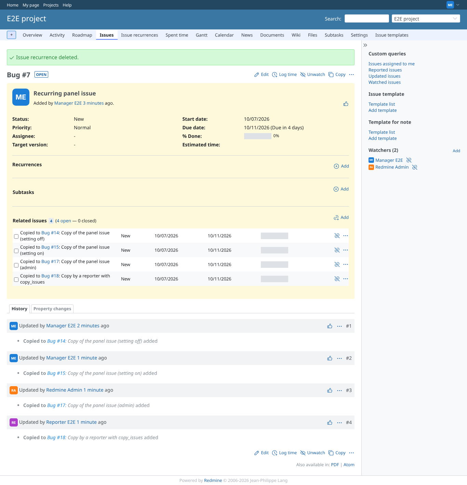

# delete-recurrence

Run 2026-10-07T16:58:08.256Z against http://127.0.0.1:3003.

| screenshot | user | URL | shows |
|---|---|---|---|
|  | manager | `/issues/7` | Manager: the recurrence before deleting (reporter DELETE answered 403, record kept) |
|  | manager | `/issues/7` | Deleted: row removed, notice "Issue recurrence deleted." |

## Problems

- /issues/7 as reporter: HTTP 403, expected 200
