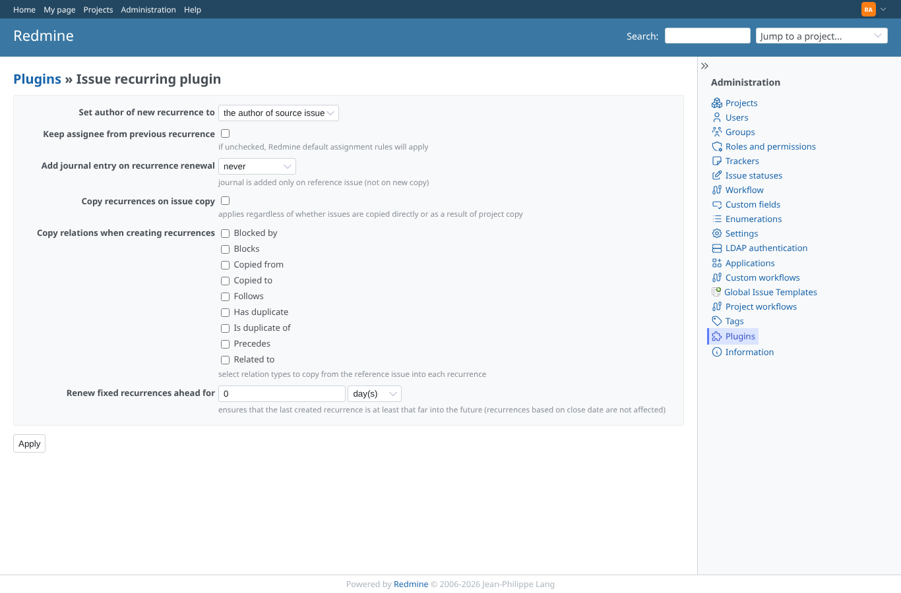
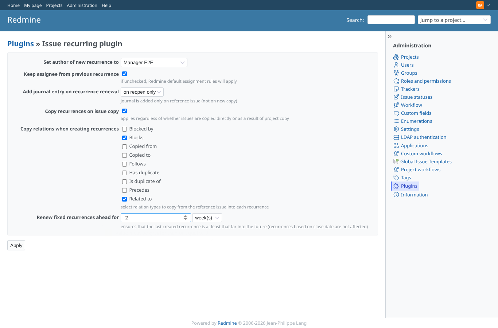
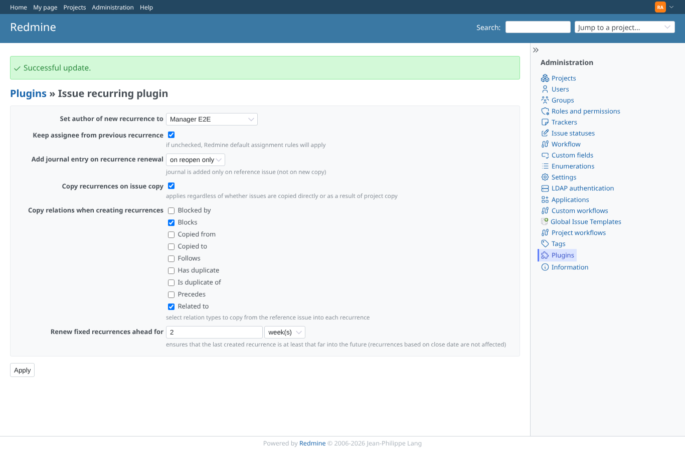
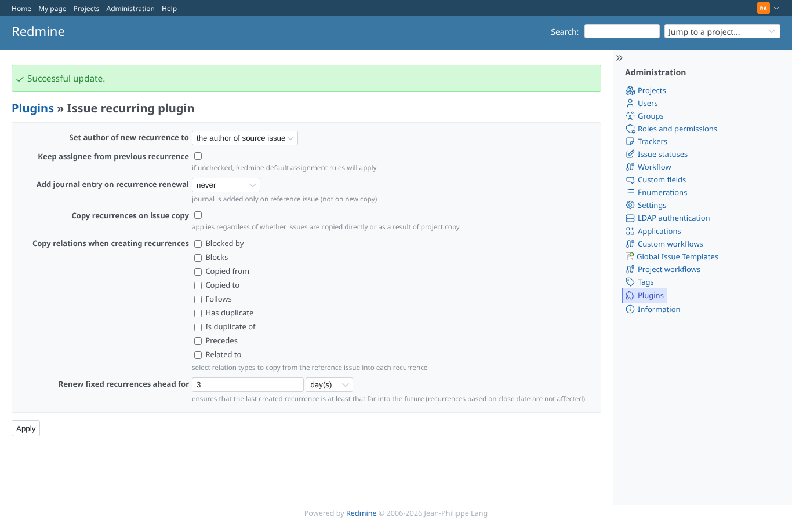

# plugin-settings

Run 2026-10-07T16:59:43.541Z against http://127.0.0.1:3003.

| screenshot | user | URL | shows |
|---|---|---|---|
|  | admin | `/settings/plugin/issue_recurring` | Admin: the settings with their defaults |
|  | admin | `/settings/plugin/issue_recurring` | A negative "renew ahead" is refused by the form before it is sent |
|  | admin | `/settings/plugin/issue_recurring` | Saved: "Successful update", the values are shown again. Stored: {"author_login":"manager","keep_assignee":true,"journal_mode":"on_reopen","copy_recurrences":true,"copy_relation_types":["blocks","relates"],"ahead_multiplier":2,"ahead_mode":"weeks"} |
|  | admin | `/settings/plugin/issue_recurring` | Hand-made POST with unknown values and -3 (HTTP 302): stored {"author_login":null,"keep_assignee":false,"journal_mode":"never","copy_recurrences":false,"copy_relation_types":[],"ahead_multiplier":3,"ahead_mode":"days"} |
|  | manager | `/settings/plugin/issue_recurring` | Manager (not admin): the plugin settings are refused (403) |
