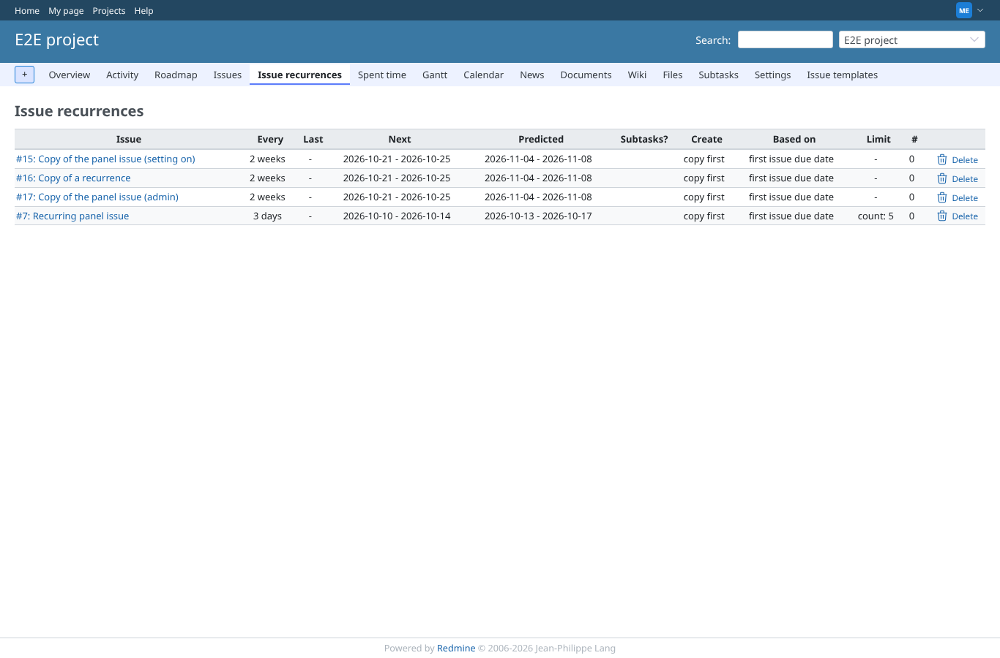
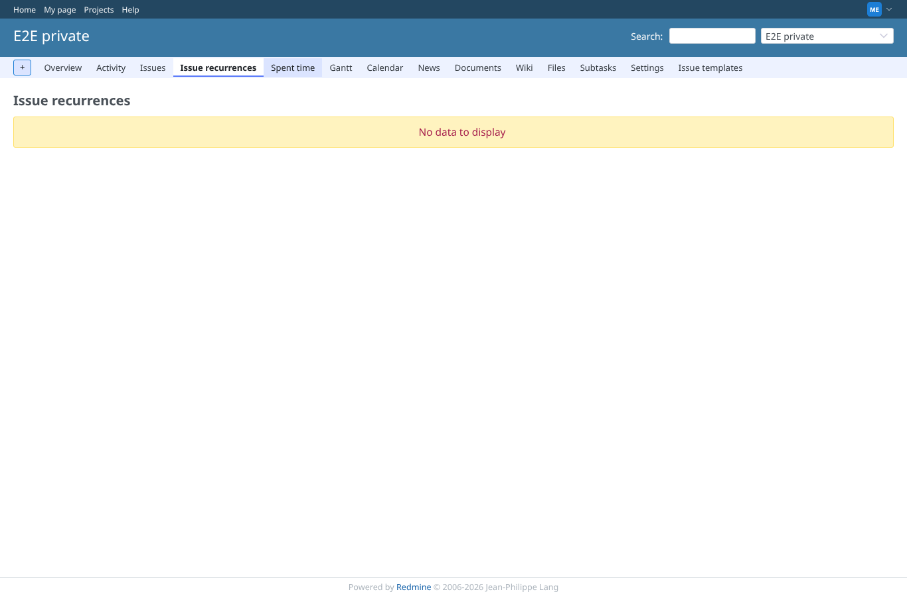
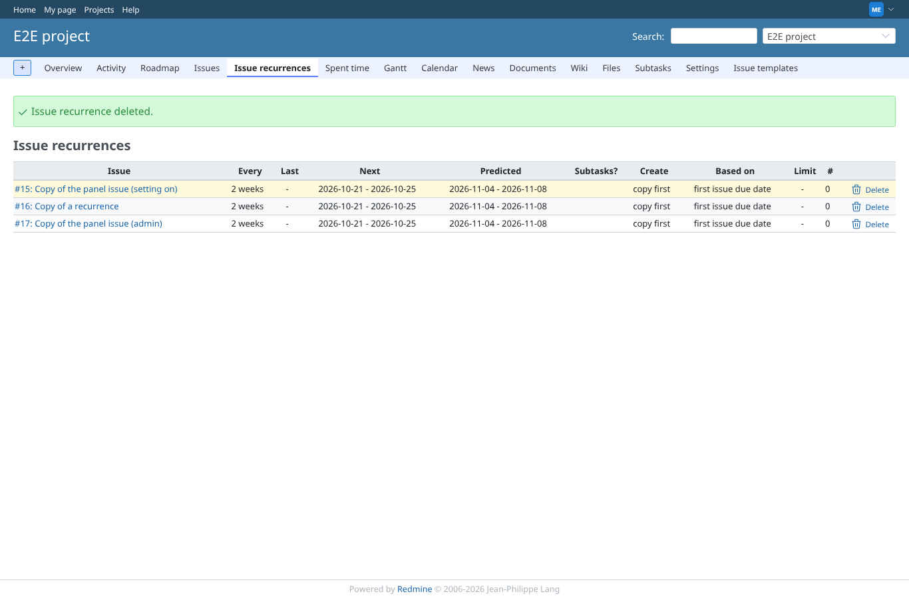
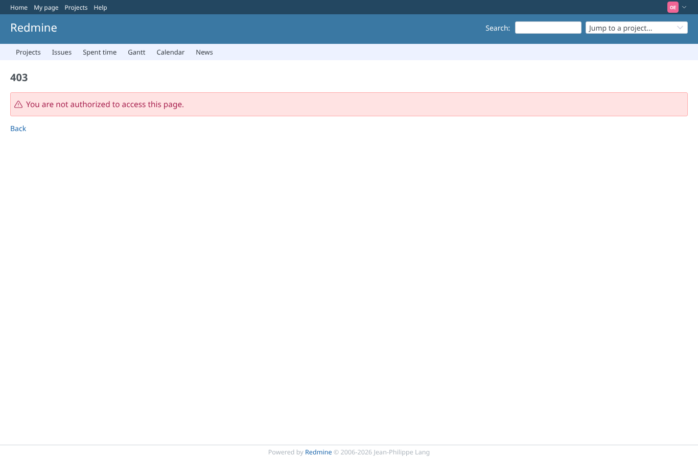

# project-recurrences

Run 2026-10-07T17:00:25.573Z against http://127.0.0.1:3003.

| screenshot | user | URL | shows |
|---|---|---|---|
|  | manager | `/projects/e2e-project/recurrences` | Manager: tab "Issue recurrences" lists issue, mode, last/next/predicted, limit, count and a delete icon |
|  | manager | `/projects/e2e-private/recurrences` | Empty state: a project without recurrences shows "No data to display" |
|  | manager | `/projects/e2e-project/recurrences` | Delete from the list removes the row (and the record) |
|  | reporter | `/projects/e2e-project/recurrences` | Reporter: no tab in the project menu, the list is refused (403) |
|  | outsider | `/projects/e2e-private/recurrences` | Outsider: the list of the private project is refused (403) |
|  | anonymous | `/login?back_url=http%3A%2F%2F127.0.0.1%3A3003%2Fprojects%2Fe2e-project%2Frecurrences` | Anonymous: sent to the login page |
