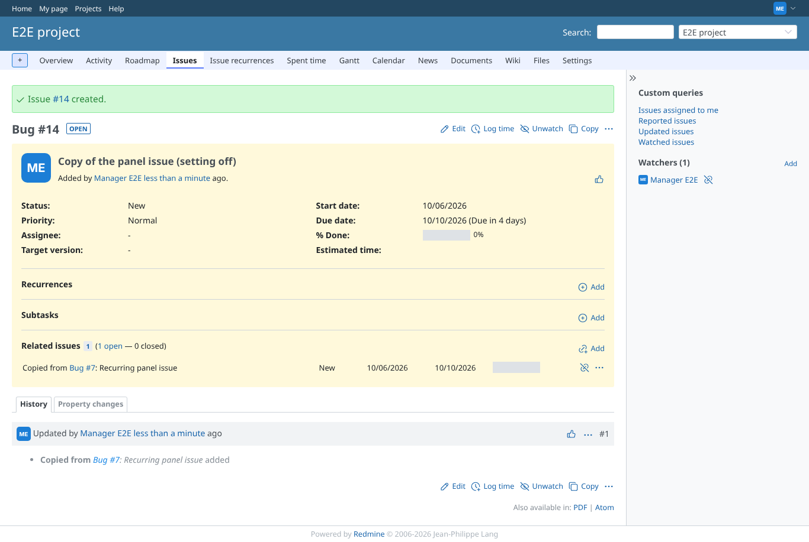
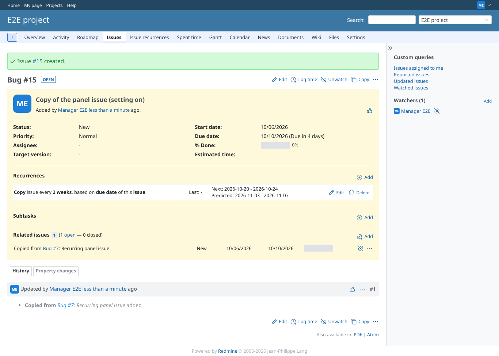
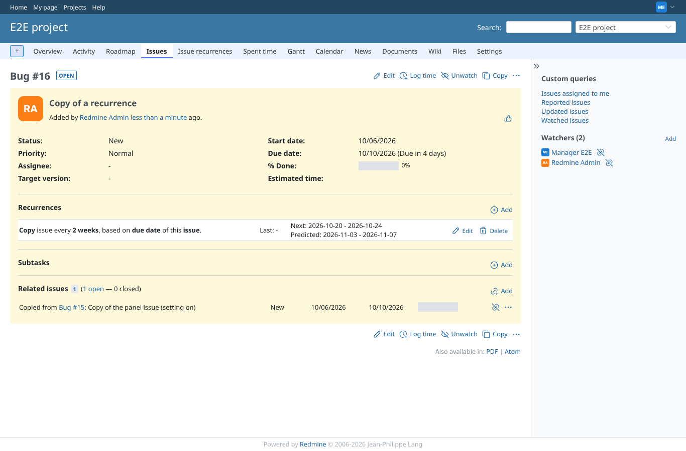

# copy-issue

Run 2026-10-06T20:41:34.057Z against http://127.0.0.1:3000.

| screenshot | user | URL | shows |
|---|---|---|---|
|  | manager | `/issues/14` | Setting off (default): the copied issue has no recurrence |
|  | manager | `/issues/15` | Setting on: the copied issue gets its own copy of the recurrence (every 2 weeks), no "recurrence of" |
|  | manager | `/issues/16` | Copying an issue that is itself a recurrence: the copy is not marked "recurrence of" |
