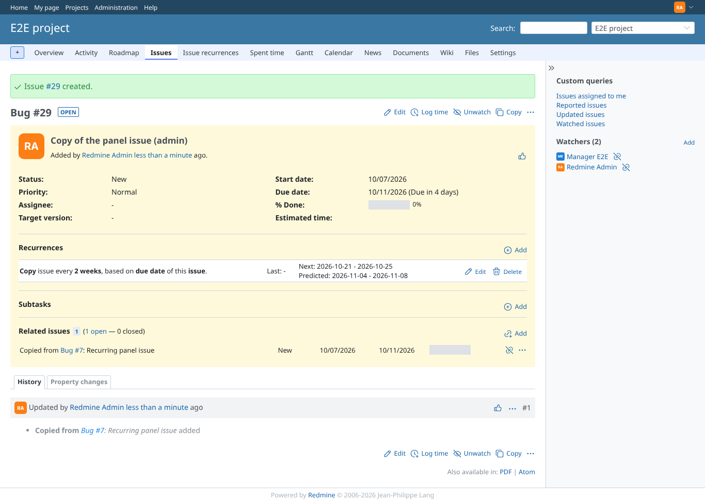
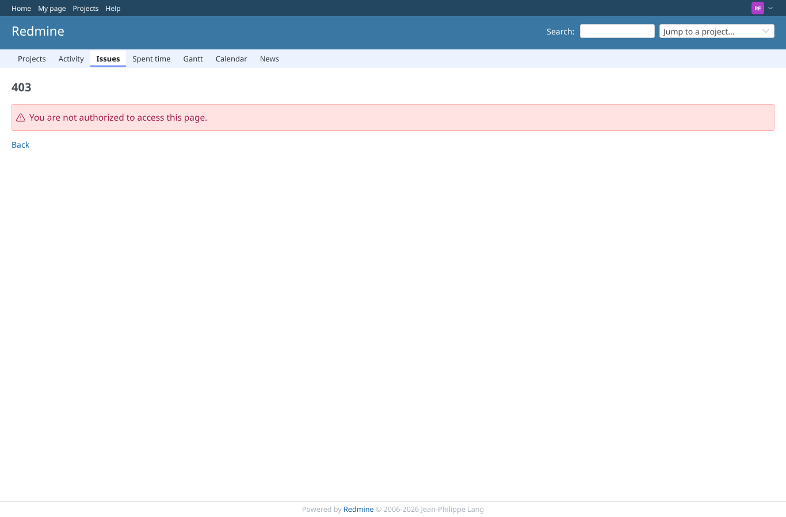
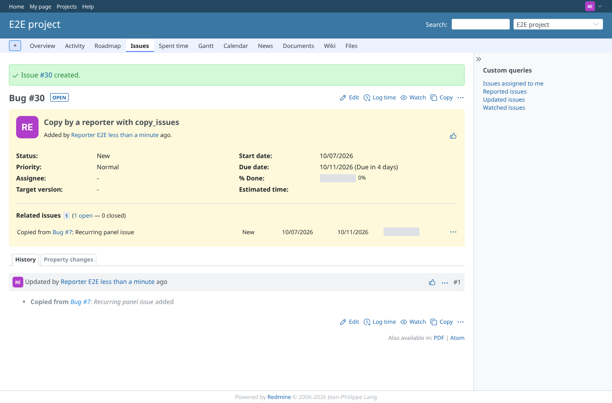

# copy-issue

Run 2026-10-07T17:16:07.563Z against http://127.0.0.1:3000.

| screenshot | user | URL | shows |
|---|---|---|---|
|  | manager | `/issues/26` | Setting off (default): the copied issue has no recurrence |
|  | manager | `/issues/27` | Setting on: the copied issue gets its own copy of the recurrence (every 2 weeks), no "recurrence of" |
|  | manager | `/issues/28` | Copying an issue that is itself a recurrence: the copy is not marked "recurrence of" |
|  | admin | `/issues/29` | Admin, setting on: the copy gets the recurrence as well |
|  | reporter | `/projects/e2e-project/issues/7/copy` | Reporter (no copy_issues): copying is refused (403) |
|  | reporter | `/issues/30` | Reporter with copy_issues, no recurrence permission, setting on: issue #30 created with 0 recurrence(s) |
|  | outsider | `/projects/e2e-private/issues/12/copy` | Outsider: copying an issue of the private project is refused (403) |
