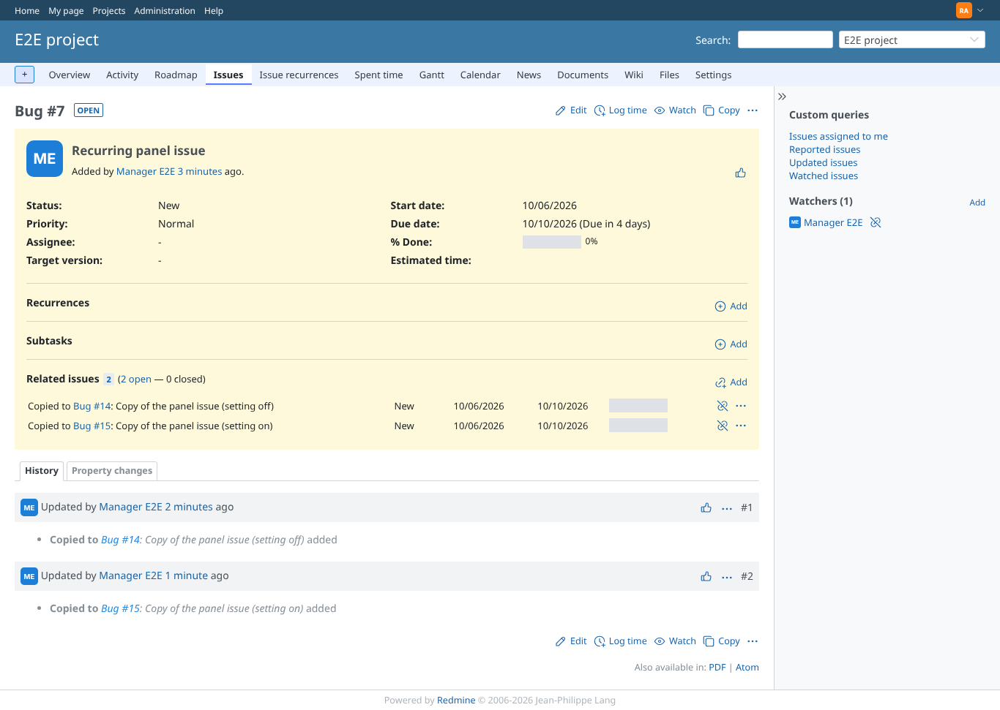
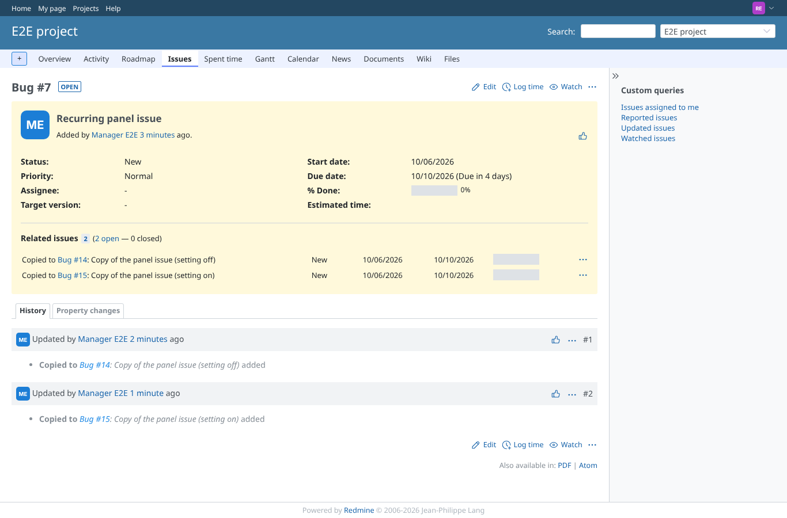
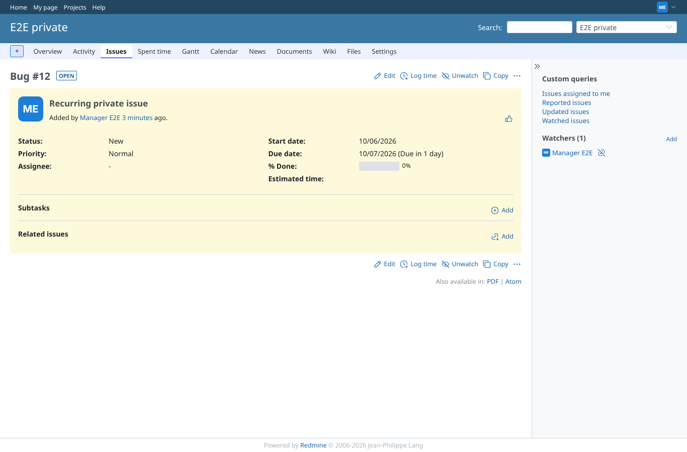
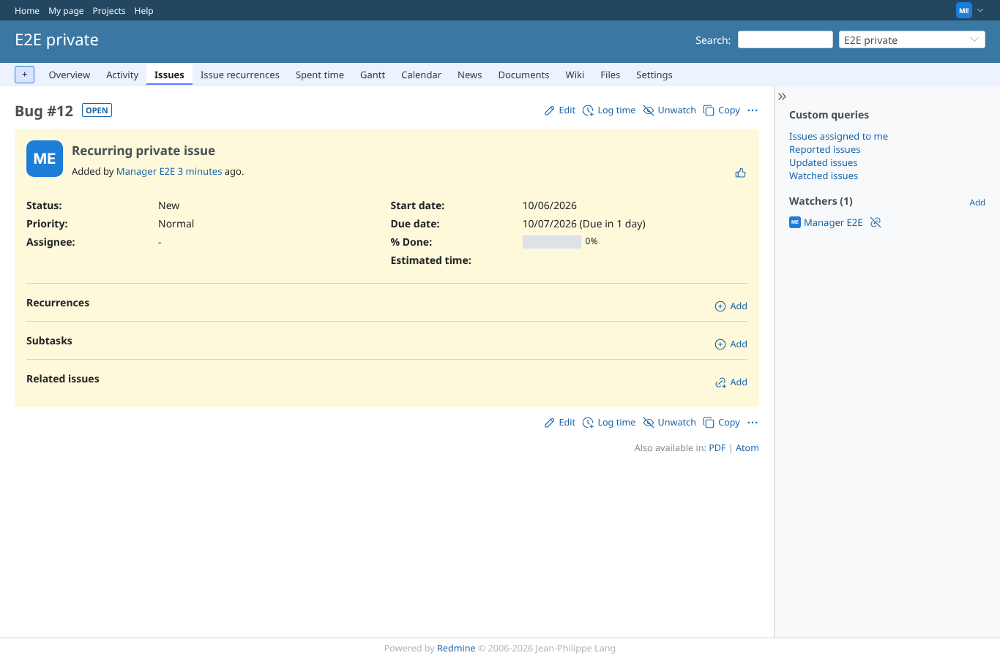

# issue-panel

Run 2026-10-06T20:42:51.484Z against http://127.0.0.1:3000.

| screenshot | user | URL | shows |
|---|---|---|---|
|  | manager | `/issues/7` | Manager (view + manage): panel with Add link, no recurrence yet (empty state) |
|  | admin | `/issues/7` | Admin: panel with Add link |
|  | reporter | `/issues/7` | Reporter (no plugin permission): the issue shows, the panel does not |
|  | outsider | `/issues/12` | Outsider: an issue of the private project is refused (403) |
|  | manager | `/issues/12` | Module "Issue recurring" disabled in the project: no panel for the manager |
|  | manager | `/issues/12` | Module enabled again: the panel is back |
