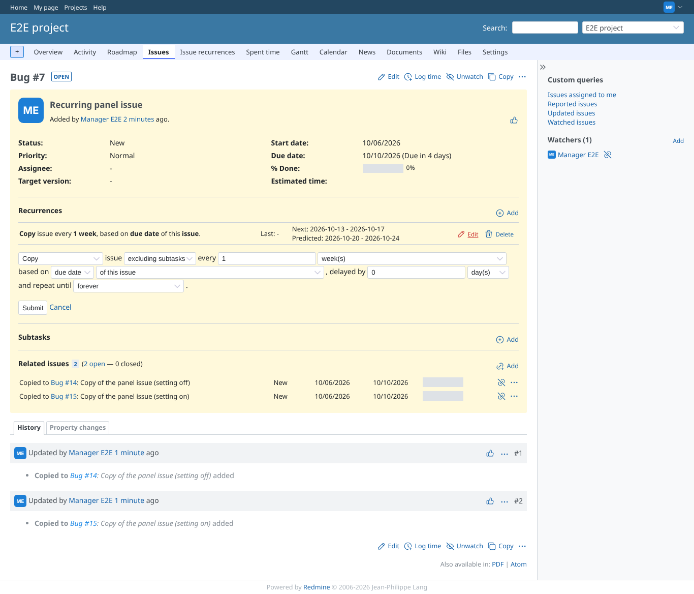
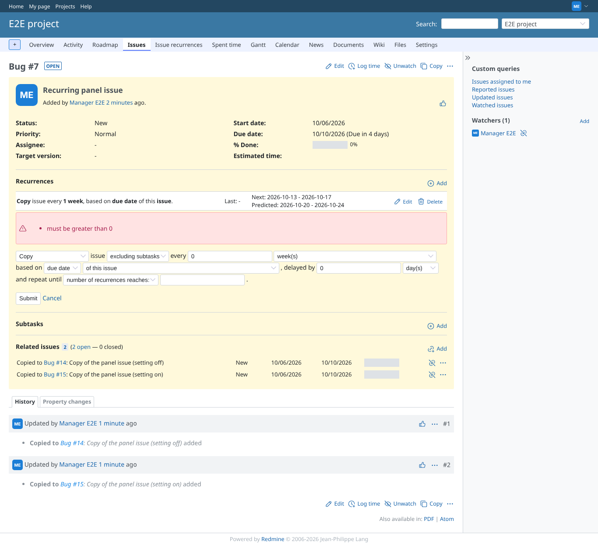
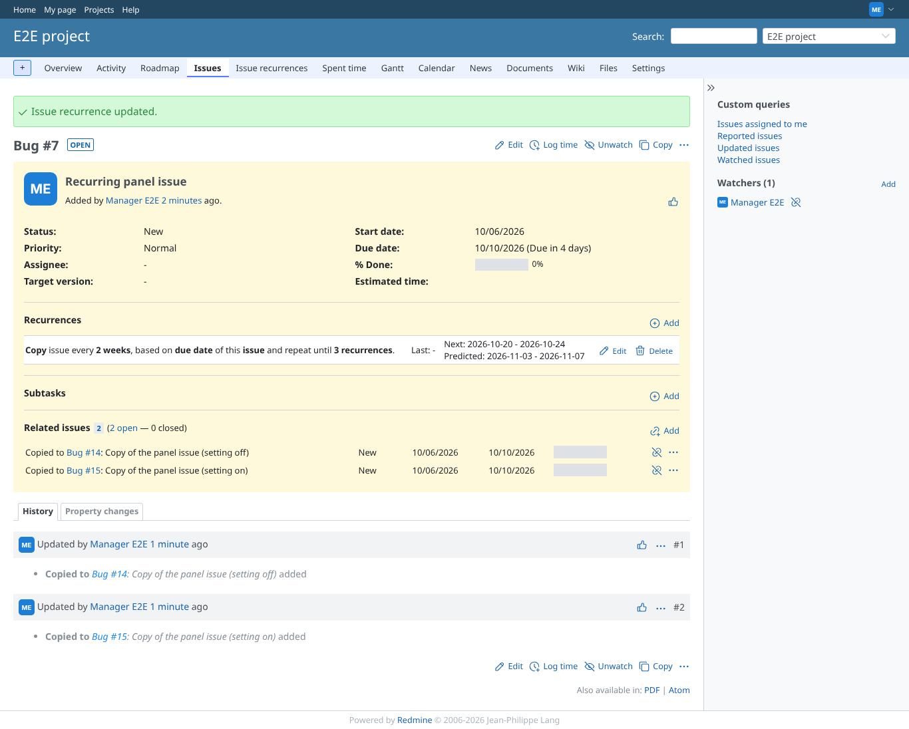

# edit-recurrence

Run 2026-10-06T20:53:57.203Z against http://127.0.0.1:3002.

| screenshot | user | URL | shows |
|---|---|---|---|
|  | manager | `/issues/7` | Edit opens the form with the saved values (every 1 week) |
|  | manager | `/issues/7` | Multiplier 0 is refused with a message; the saved recurrence is unchanged |
|  | manager | `/issues/7` | Updated: notice, "every 2 weeks ... until 3 recurrences" |
|  | reporter | `/recurrences/6/edit` | Reporter: the edit form is refused (403) |
|  | manager | `/recurrences/999999/edit` | A recurrence that does not exist: 404 |
