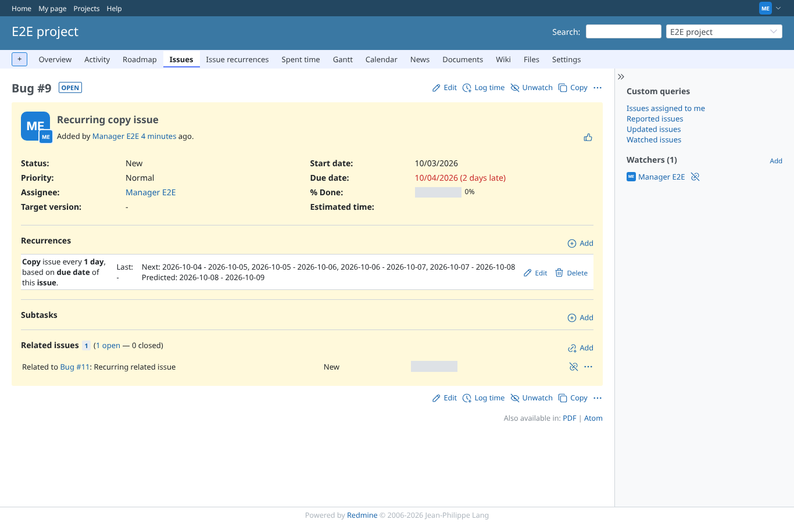
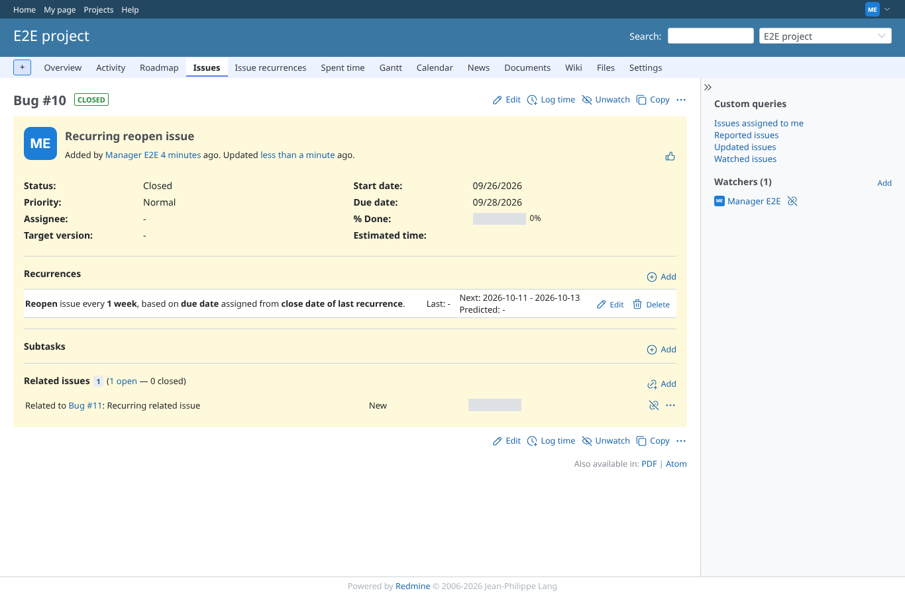
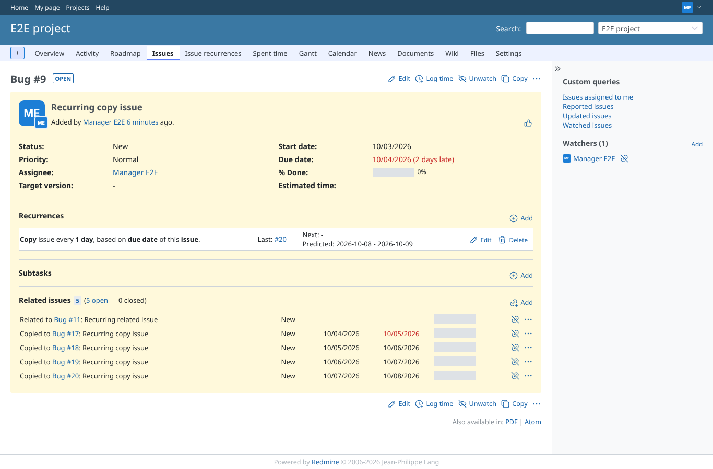
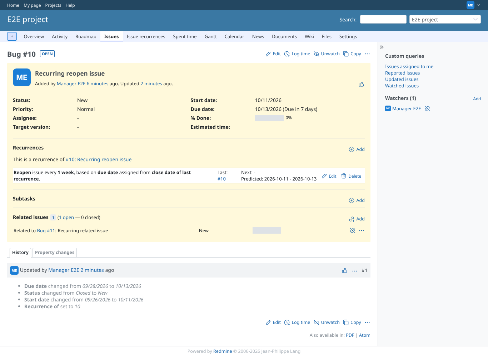

# renew

Run 2026-10-06T20:58:00.547Z against http://127.0.0.1:3002.

| screenshot | user | URL | shows |
|---|---|---|---|
|  | manager | `/issues/9` | Before the cron run: daily copy recurrence, "Last: -", next dates up to tomorrow |
|  | manager | `/issues/10` | Before the cron run: the reopen-mode issue is closed and relates to "Recurring related issue" |
|  | manager | `/issues/9` | After rake renew_all: 4 copies [[17,"2026-10-04","2026-10-05","New"],[18,"2026-10-05","2026-10-06","New"],[19,"2026-10-06","2026-10-07","New"],[20,"2026-10-07","2026-10-08","New"]]; "Last: #20" links the newest |
|  | manager | `/issues/20` | A copy: status New, its own dates, "This is a recurrence of #...", the "relates" relation copied (setting) |
|  | manager | `/issues/10` | Reopen mode: the issue is open again with dates 2026-10-11 - 2026-10-13, its relation kept, a journal entry (journal mode "on reopen") |
|  | manager | `/issues/20` | Mails: 4 "Recurring copy issue" messages to reporter (mail_notification all); webhooks received: issue.created for [17,18,19,20,21,22], issue.updated for the reopened #10: true |
