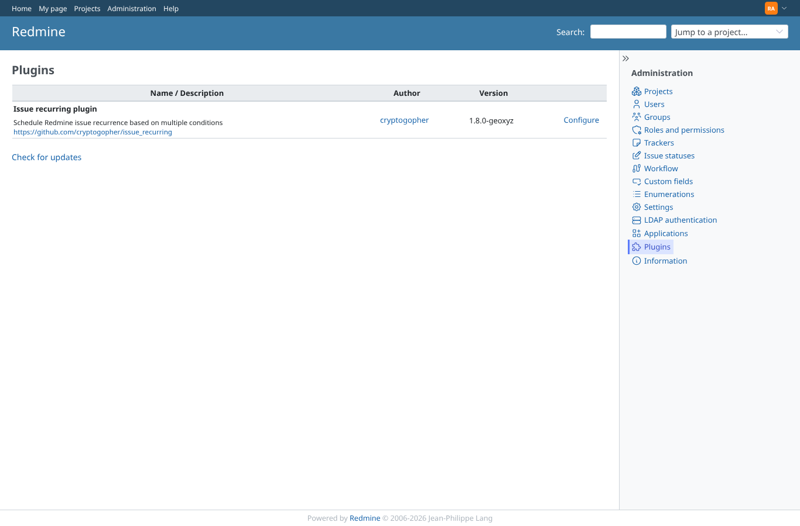

# plugin-version

Run 2026-10-07T16:28:40.248Z against http://127.0.0.1:3000.

| screenshot | user | URL | shows |
|---|---|---|---|
|  | admin | `/admin/plugins` | Admin: Administration > Plugins lists "Issue recurring plugin" with version 1.8.0-geoxyz |
|  | manager | `/admin/plugins` | manager: the plugin list is refused (403) |
|  | reporter | `/admin/plugins` | reporter: the plugin list is refused (403) |
|  | outsider | `/admin/plugins` | outsider: the plugin list is refused (403) |
